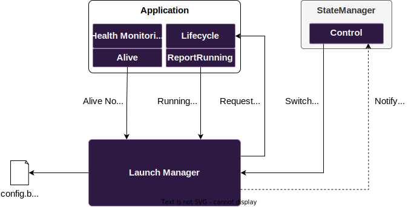

# Lifecycle & Health

## Overview

[](https://eclipse-score.github.io/score/main/features/lifecycle/index.html)

Portable and high-performance implementation of the Lifecycle feature for the S-CORE project.

High level functionality provided by Lifecycle:

* **Launch Manager**
    * **Portability**: LaunchManager works with multiple operating systems including Linux and QNX8.
    * **Component Lifecycle Control**: Spawning and terminating OS processes according to their configured parameters (executable path, user/group identity, environment, scheduling policy, etc.).
    * **Run Target Management**: Determining which components are active at any given time by activating and deactivating named Run Targets in response to requests from a StateManager.
    * **Dependency Resolution**: Ensuring components start and stop in the correct order based on declared startup and shutdown dependencies.
    * **Failure Recovery**: Detecting unexpected process termination and executing configured recovery actions such as restarting a component or switching to a recovery Run Target.
    * **External Watchdog Integration**: Compatible with external watchdogs through configurable watchdog device file.
* **Health Monitor**
    * **Supervision Types**: Supports Heartbeat, Deadline, and Logical supervision to verify the timing and control flow of process execution.
    * **Alive Notifications**: Supervision results are translated into alive notifications sent to the Launch Manager to communicate supervision status and report failures.

## Public APIs



**Health Monitoring API**

```
//score/health_monitor:health_monitoring_cc
//score/health_monitor:health_monitoring_rust
```

The Health Monitoring library provides APIs for the following supervisions:
* Heartbeat Supervision
* Deadline Supervision
* Logical Supervision

These supervision results are translated to alive notifications that are sent to the Launch Manager via its *Alive API*.

See the [C++ Supervised Example Application](examples/cpp_supervised_app) and [Rust Supervised Example Application](examples/rust_supervised_app).

**Alive API**

```
//score/launch_manager:alive_cc
//score/launch_manager:alive_rust
```

The *Alive API* allows applications to report alive notifications to the Launch Manager.
Applications may either use the higher-level *Health Monitoring APIs* or directly report alive notifications to the Launch Manager via the *Alive API*.

**Lifecycle API**

```
//score/launch_manager:lifecycle_cc
//score/launch_manager:lifecycle_rust
```

Applications can report the *Running state* to the Launch Manager to signal that initialization is finished and dependent applications can now be started.

Applications may either use the higher-level [``score::mw::lifecycle::Application``](score/launch_manager/src/lifecycle_client/src/application.h) API or the lower level [``score::mw::lifecycle::report_running``](score/launch_manager/src/lifecycle_client/src/report_running.h) function.

See examples [Application Example](examples/cpp_lifecycle_app) and [report_running example](examples/cpp_supervised_app).

**Control API**

```
//score/launch_manager:control_cc
```

The *Control API* is intended for implementing a State Manager that controls which *Run Target* is currently active.

See the [Example StateManager](examples/control_application).

**Launch Manager**

```
//score/launch_manager:launch_manager
```

The *launch_manager* target contains the daemon executable.

The Launch Manager is configured with a JSON file that is compiled to a binary format using the bazel macro:

```starlark
load("//:defs.bzl", "launch_manager_config")

launch_manager_config(
    name = "examples_test_config",
    config = ":lifecycle_demo_test.json",
    flatbuffer_out_dir = "etc",
)
```

See the [demo scenario](examples/demo_verification) for an example.

**Mocks**

```
//score/launch_manager:applicationcontext_mock_cc
//score/launch_manager:lifecycle_mock_cc
//score/launch_manager:report_running_mock_cc
```

## Documentation

* [Lifecycle Feature Documentation](https://eclipse-score.github.io/score/main/features/lifecycle/index.html)
* [Lifecycle Module Documentation](https://eclipse-score.github.io/lifecycle/main/)

## Getting Started

### Building

It is recommended to use the devcontainer for building the project. See [eclipse-score/devcontainer/README.md#inside-the-container](https://github.com/eclipse-score/devcontainer/blob/main/README.md) for setup instructions.

Build all components for different platforms:

**QNX**

```sh
bazel build --config=x86_64-qnx //...
bazel build --config=arm64-qnx //...
```

**Linux**

```sh
bazel build --config=x86_64-linux //...
bazel build --config=arm64-linux //...
```

To test launch_manager and health_monitor with the sanitizers enabled use one of the following

ASan + UBSan + LSan (recommended):

```sh
bazel test --config=asan_ubsan_lsan --config=x86_64-linux //score/... //tests/...
```

TSan:

```sh
bazel test --config=tsan --config=x86_64-linux //score/... //tests/...
```

To build all components with ``score::mw::log`` enabled, use this command:

```sh
bazel test --config=x86_64-linux //score/... //tests/...
```

Run tests with sanitizers: ASan + UBSan + LSan (recommended):

```sh
bazel test --config=asan_ubsan_lsan --config=x86_64-linux //score/... //tests/...
```

### Demo

See instructions [here](examples/README.md) on how to execute a demo scenario.

## Repository Structure

```
score_lifecycle/
├── score/                 # Lifecycle implementation
│   ├── launch_manager/    # Launch Manager daemon + library implementation + unit/component tests
│   └── health_monitor/    # Health Monitoring library implementation + unit/component tests
├── external/              # Third party software
├── examples/              # Example applications
├── scripts/               # Launch Manager Configuration generation
└── tests/                 # Feature Integration tests
```

## Contributing

We welcome contributions! See our [Contributing Guide](CONTRIBUTION.md) for details.

## Support

### Community
- **Issues**: Report bugs and request features via [GitHub Issues](https://github.com/eclipse-score/lifecycle/issues)
- **Discussions**: Join lifecycle [slack channel](https://sdvworkinggroup.slack.com/archives/C094Z3BN1K4)

---
